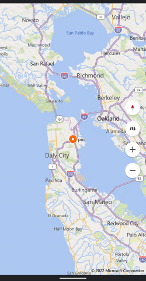

# Bing maps for Titanium



## Requirements:
* get a dev key from https://www.bingmapsportal.com/

```js
const BingMap = require("ti.bingmap");
const win = Titanium.UI.createWindow({});
const bingMap = BingMap.createBingMap({
	apiKey: "your_api_key"
});

win.add(bingMap);
win.addEventListener("open", e => {
	bingMap.location({
		lat: 37.74,
		lon: -122.41,
	})
	bingMap.addPin({
		title:"pin",
		lat: 37.74,
		lon: -122.41,
	})
})

win.open();
```
